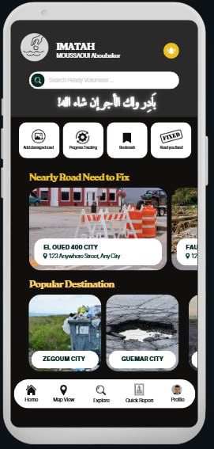

# Task 2: Implement the First UI in view/MainScreen

## Code Explanation

The codebase is structured around the Imatah application using **MVVM Architecture**. Here are the key components:

1. **MainActivity**: Acts as the entry point of the application.
2. **MainScreen**: Composable that displays the UI, including the list of reports and categories.
3. **ReportRepository**: Acts as a repository for reports.
4. **CategoryRepository**: Manages category data.
5. **Report Model & Category Model**: Define the data structure for reports and categories.

## Task

Your task is to implement the first UI in `view/MainScreen` based on the design provided in `FIrstUI.jpg`. The UI should include:

- A list of reports.
- A navigation bar to switch between categories.
- A report detail view when a report is selected.
- A search bar to filter reports by name or category.

### Additional Requirements

1. **Add More Reports and Categories**:
   - Add at least 5 more reports and 2 more categories to the mock data in `ReportRepository.kt` and `CategoryRepository.kt`.
   - Ensure the new reports and categories are displayed in the UI.

2. **Implement Search Functionality**:
   - Add a search bar to the top of the `view/MainScreen` UI.
   - Implement functionality to filter the reports list based on the search query (e.g., by report name or category).

## Instructions

1. Open `view/MainScreen.kt`.
2. Implement the UI layout in `view/MainScreen`.
3. Use the `ReportRepository` and `CategoryRepository` to fetch and display reports and categories.
4. Ensure the UI matches the design in `FIrstUI.jpg`.

## FirstUI

Good luck!
